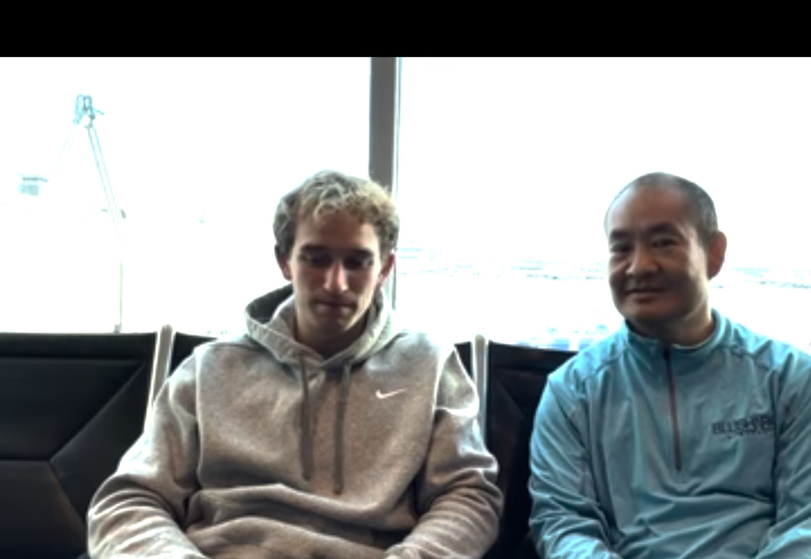
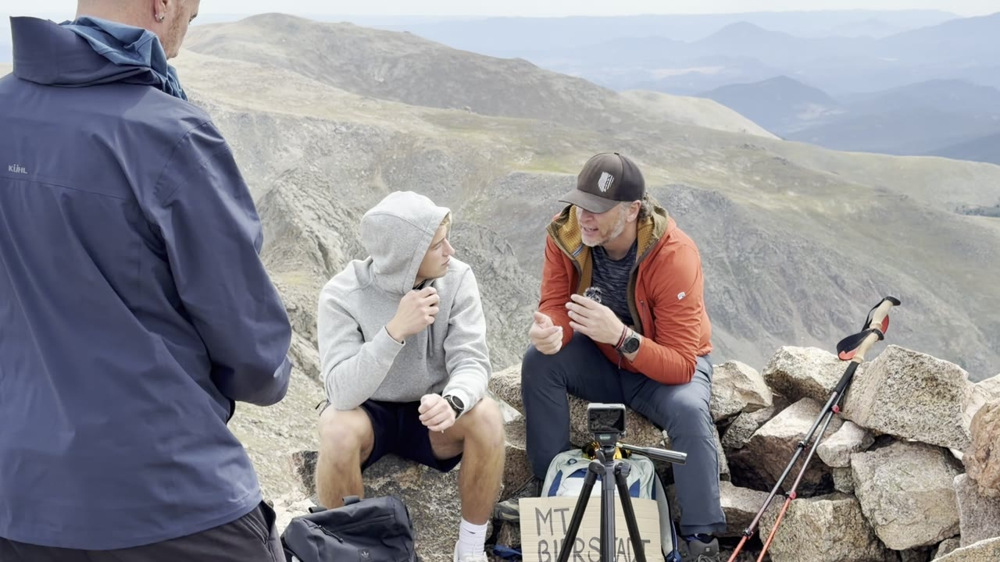
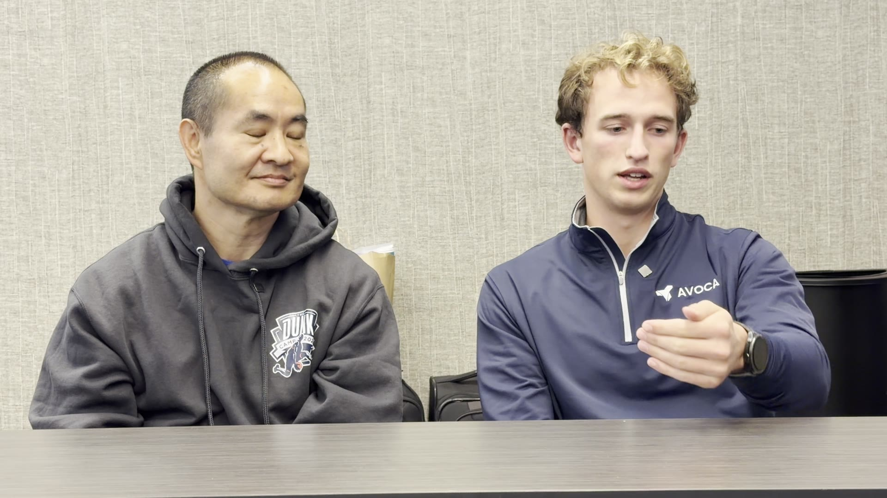
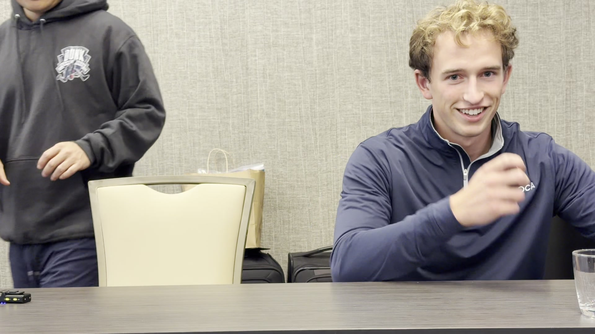
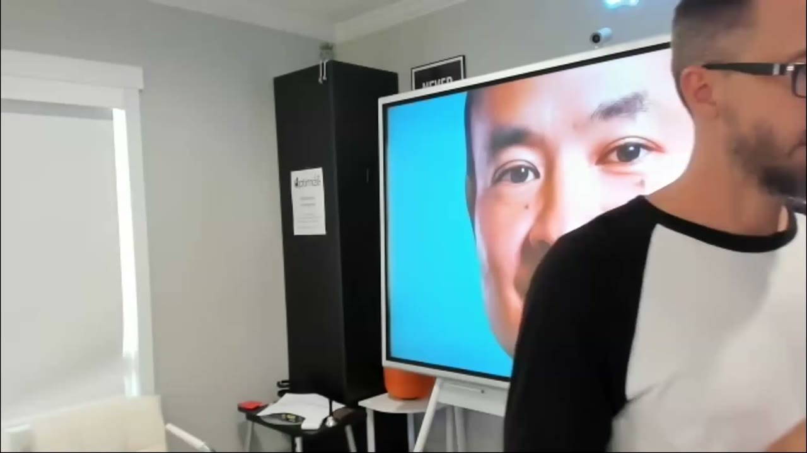
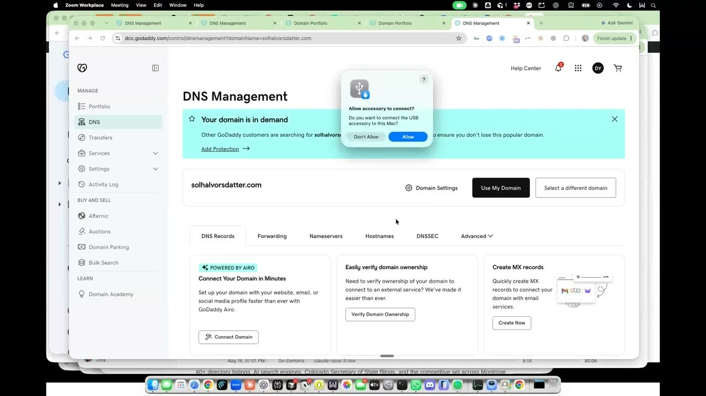

# Roanin Podkin

[Roanin Podkin](/)

*   [Home](/)
*   [Stories](/stories/)
*   [About](/about/)
*   [Contact](/contact/)

  

Roanin Podkin · Avoca · Santa Barbara

# Earn the demo before the call.

I sat with [Dennis Yu](https://dennisyu.com/) for an hour, then hiked Mt Bierstadt with [Jason Amato](https://jasongamato.com/) and the operators from his lab. The tape is the proof. The mountain is the room.

[Watch episode one](https://roaninpodkin.com/days-with-roanin-episode-1/)  
[Read the stories](/stories/)

*   **Avoca** SDR, Santa Barbara, July 2026
*   **On tape** first podcast, 28 Aug 2026
*   **On the 14er** Mt Bierstadt with Jason Amato’s room
*   **That workshop** seven ICP demos booked

## With Dennis Yu, and with the operators

The Friday hour, the Denver airport chair, and the summit conversation. Click a frame for the article. The long tapes sit on [Local Service Spotlight](https://localservicespotlight.com/)’s Descript drive until YouTube handles exist.

[  
  
  
Days with Roanin — episode 1  
](https://roaninpodkin.com/days-with-roanin-episode-1/)  
[  
  
  
14er in the morning, airport tape at night  
](https://roaninpodkin.com/airport-tape-at-night/)  
[  
  
I hiked a 14er with Jason Amato  
](https://roaninpodkin.com/hiked-a-14er-with-jason-amato/)  
[  
  
SDR in a room of contractors  
](https://roaninpodkin.com/sdr-in-a-room-of-contractors/)  
[  
  
Seven ICP demos. That workshop.  
](https://roaninpodkin.com/seven-icp-demos-that-workshop/)  
[  
  
Owners buy trust, not the cheaper install  
](https://roaninpodkin.com/owners-buy-trust/)  
[  
  
  
The Magic Berry I just lived  
](https://roaninpodkin.com/the-magic-berry-i-just-lived/)  
[  
  
  
Phone proof at Denver airport  
](https://roaninpodkin.com/phone-proof-at-denver-airport/)

## The tapes

Episode one is the hour in Broomfield. The sister tape is twenty-two minutes at DEN, no lav, suitcase out of frame.

**On this tape:** Roanin Podkin and Dennis Yu.

### Who I am

Sales development at [Avoca](https://www.avoca.ai/). UCSB Economics. Santa Barbara. The public title still says SDR. The work is to be the person a plumber already trusts before the calendar hold.

[About](/about/)

### Who put me in the room

[Jason Amato](https://jasongamato.com/) ran the Operations Mastery Lab. [Dennis Yu](https://dennisyu.com/) sat down and hit record.

[Perceived vs real](https://roaninpodkin.com/perceived-influence-to-the-real-thing/)

Roanin Podkin · Avoca · Santa Barbara  
[Honor page on dennisyu.com](https://dennisyu.com/roaninpodkin/) · [Contact](/contact/)

ROANIN-PODKIN-IMMERSIVE-2026-08-30  
ROANIN-PODKIN-TRUST-2026-09-01
