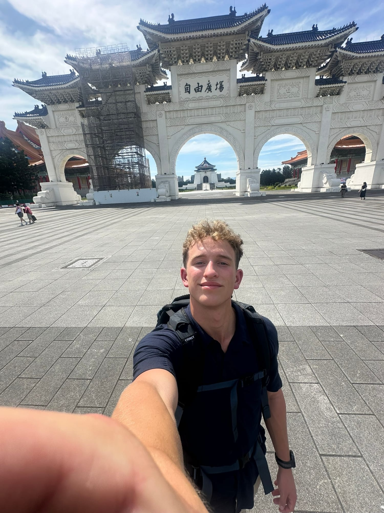
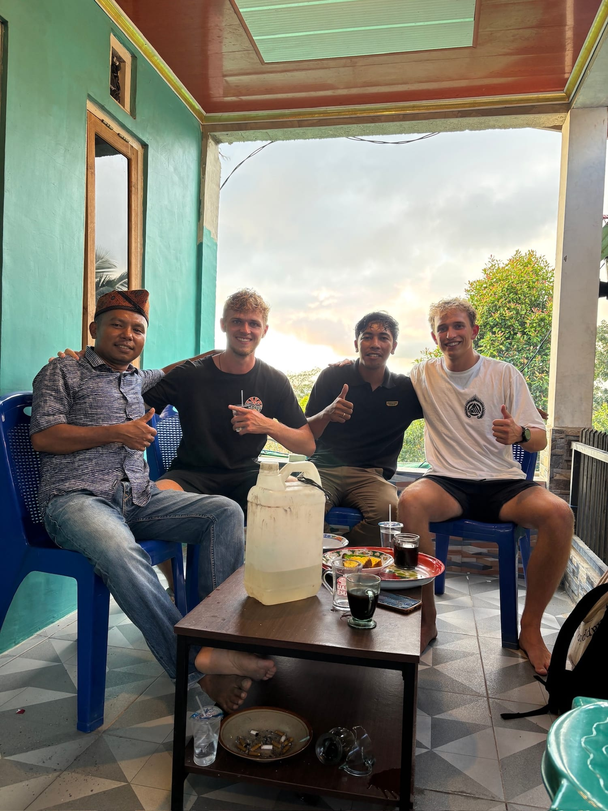
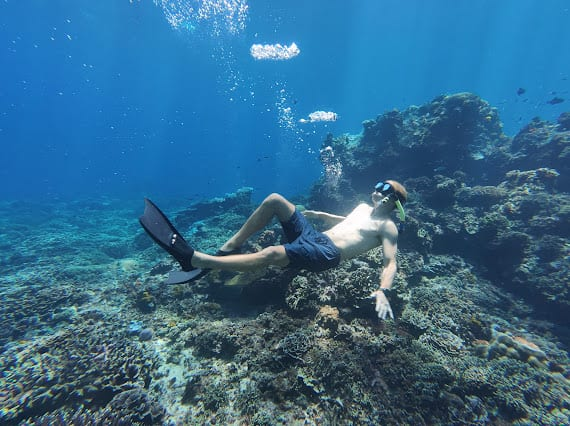

The summer before my last year, I went to Asia alone for almost two months.

*Taipei. First stop.*

I did a lot of things I'd never done. Got PADI scuba certified. Went on some crazy side quests and met all kinds of people. Saw some of the most beautiful nature I've ever seen. Dove with whale sharks. Lived on a boat for four days. And a lot more.

Mostly, though, the trip was a chance to step back and ask: do I like who I've become, who do I want to be, and what do I really want? I still do that audit often.

*Making friends in random places. Flores.*

*Under the sea.*
