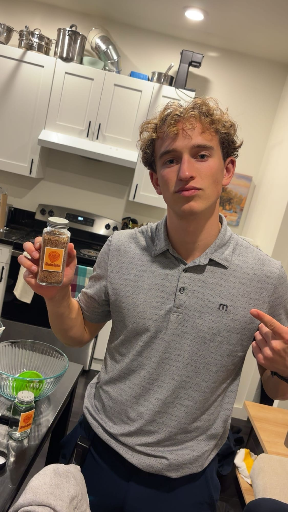
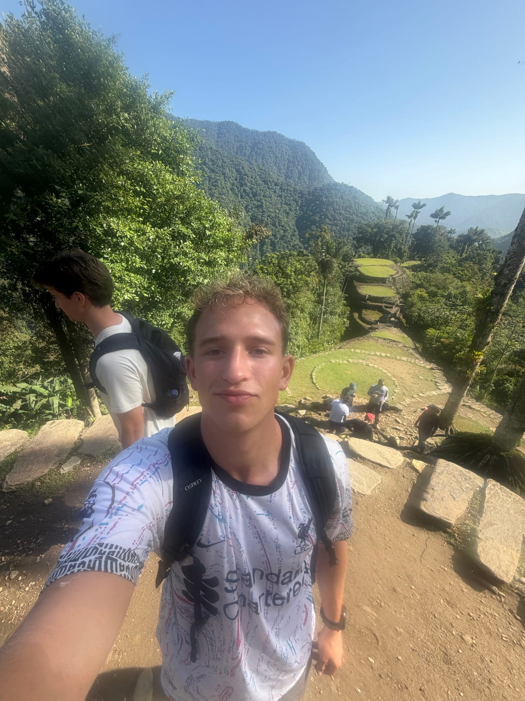
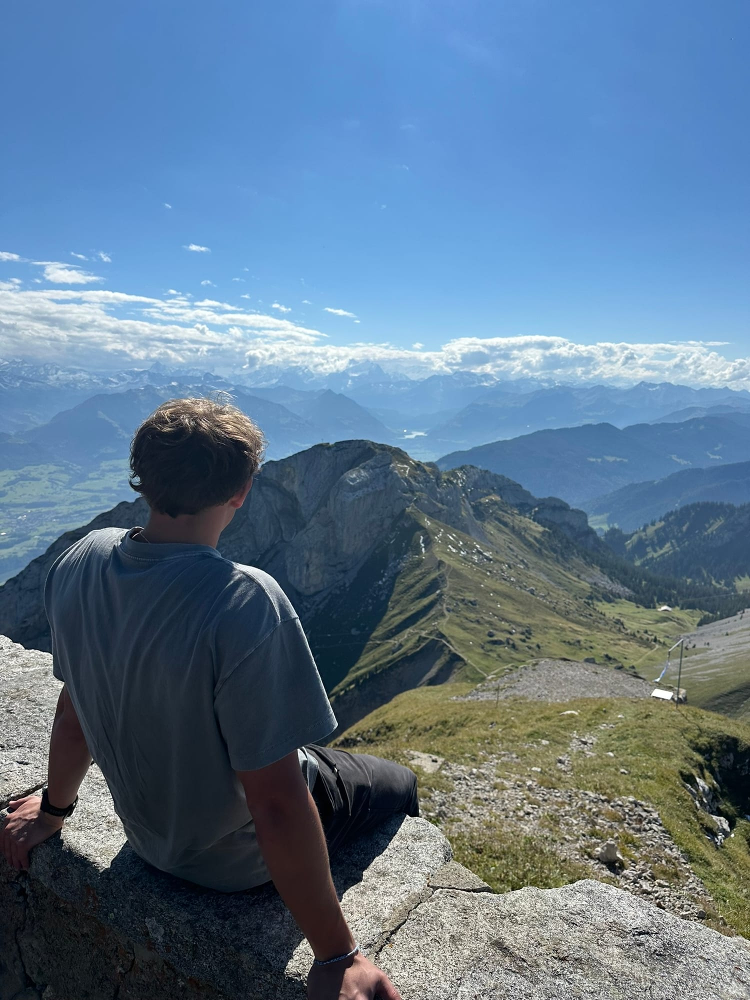

Not every story is a chapter. These are the side quests.

## Shaka Spice

My mom had a seasoning blend recipe that was too good to stay in the kitchen, so I made it a business. I bought the ingredients, mixed it, bottled it under the Shaka Spice label and sold it at tables and by word of mouth. It was good. It just wasn't as good as the other things I was working on at the time, so I let it go.

*Shaka Spice.*

## Mt Bierstadt

On August 28, 2026, I sat down with [Dennis Yu](https://dennisyu.com/) in Broomfield, Colorado, and recorded what I called episode one. We were there because [Jason Amato](https://jasongamato.com/) had put a workshop together for home-service operators. By the end of it, seven of them had booked a demo. The next morning we hiked Mt Bierstadt, 14,065 feet. That night Dennis and I talked at Denver airport until my 7:20 flight.

## Teyuna

Right after graduation, before Avoca started, I went to Colombia and did the four-day hike through the jungle to Teyuna, the Lost City.

*Teyuna.*

## Europe

During the Madrid semester in fall 2024 I got to as many countries as I could. This is Switzerland.

*Climbing mountains.*
