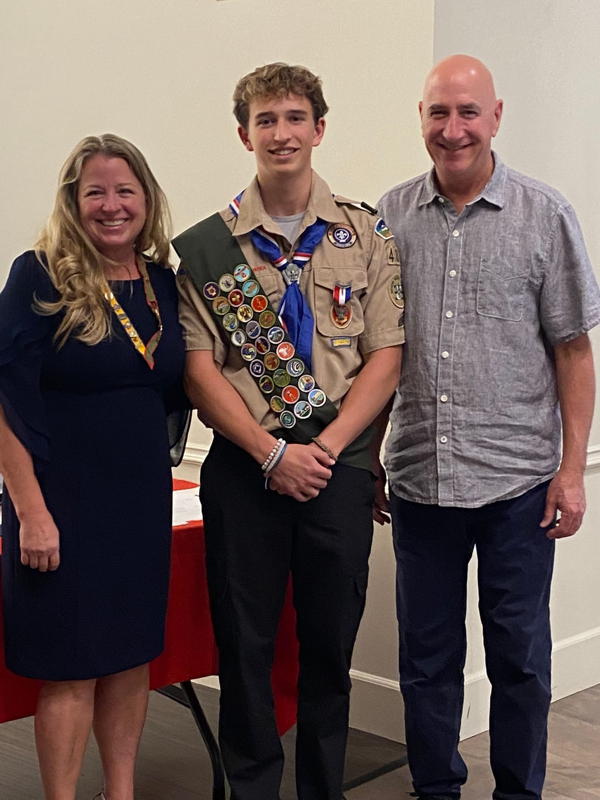
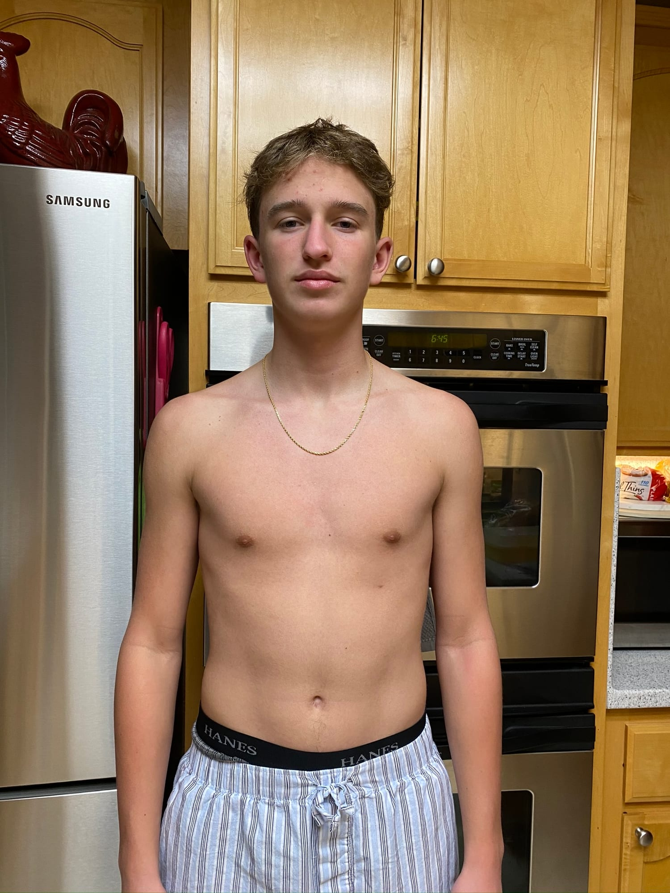
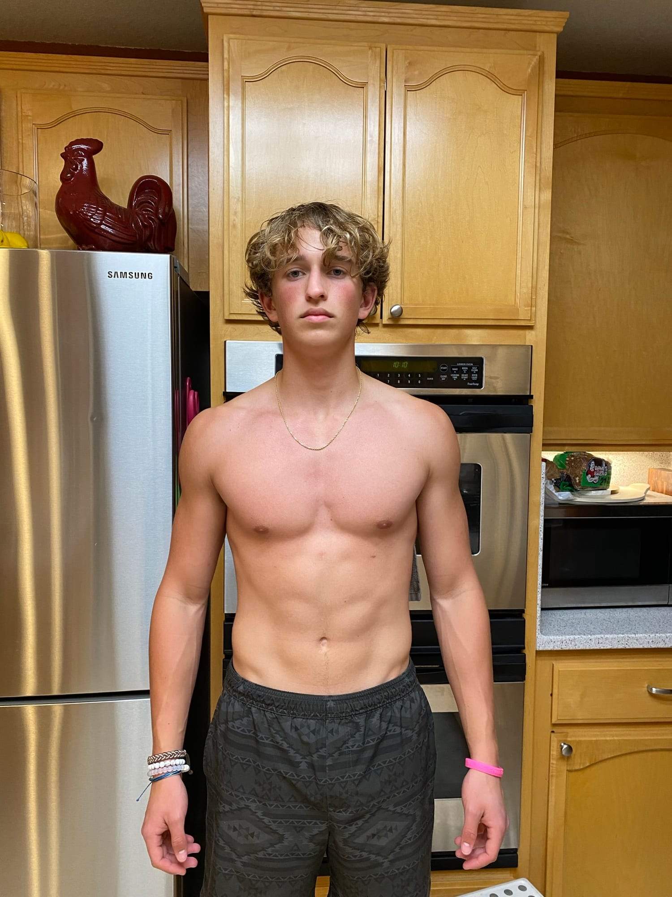

I grew up in Vacaville, California. I've been playing golf since I was a kid, and I was always looking for a way to make a few dollars, whatever it took.

My mom likes to tell a story from when I was about three. I stepped off a rock and fell, and it made me so mad that I climbed back up and stepped off again. Then again. Not until I got it right once, but until I couldn't get it wrong. I don't remember it. I recognize it.

*Eagle Scout, with my parents.*

My first job was at In-N-Out, for a year in high school. People sometimes ask where the work ethic comes from. I think it was always there. The jobs just gave it somewhere to go.

## Sixteen

One more from back then, since you scrolled this far. At sixteen I decided to take my health seriously and gave it a year. Same kitchen, one year apart.

*A year of showing up.*
