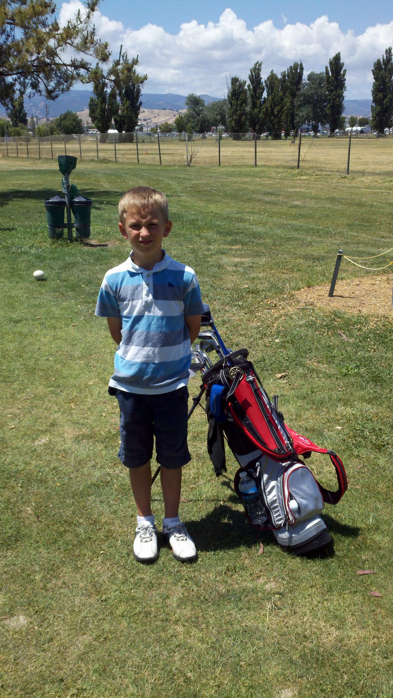

I grew up in Vacaville, California. I've always looked for a way to make a few extra dollars, whatever it takes.

My mom likes to tell a story from when I was about three. I stepped off a rock and fell, and it made me so mad that I climbed back up and stepped off again. Then again, nonstop. Not until I got it right once, but until I couldn't get it wrong. I don't remember it, but it's a good testament to who I am.

*Me as a kid with a golf bag. I've been playing since I was about this age.*

*Eagle Scout, with my parents.*
